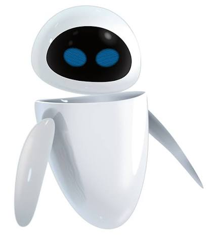

# Proyecto-Mecatronica 4250-EVA

## Integrantes
* Agustín Ketterer
* Isabella Silva
* Katalyna Tapia
* Joaquín Zúñiga
## Profesor
* Harold Valenzuela
## Auxiliar
* Fernando Navarrete
## Ayudantes
* Valentina Abarca
* Emilia Gutiérrez
# Índice de contenidos
* [Descripción](#descripción)
* [Objetivos](#objetivos)
* [Listado de materiales](#listado-de-materiales)
* [Diseño](#diseño)
* [Electrónica](./Electrónica)
* [Software y lógica](./Software)
* [Archivos CAD](./EVA%20CADs/)
* [Códigos](#código)
* [Multimedia](./Multimedia)
  
# Descripción
El presente repositorio contiene la documentación, códigos y modelos 3D correspondientes al desarrollo del Robot Autobalancín "EVA".

El prototipo consiste en un péndulo invertido sobre dos ruedas capaz de mantener su verticalidad de forma autónoma frente a perturbaciones. A diferencia de los modelos clásicos, este proyecto destaca por incorporar un diseño estético basado en el personaje EVA de la película WALL-E, que responde a la solicitud de aplicar una estética futurista a nuestra propuesta, modelado íntegramente en Fusion 360. Para compatibilizar esta geometría con las exigencias dinámicas del equilibrio, se desarrolló una arquitectura interna estructurada en niveles que optimiza el centro de masa y permite un enrutamiento limpio del hardware.

A nivel de sistema, el robot es contorlado por una placa Arduino Uno, la cual procesa en tiempo real los datos de inclinación y aceleración capturados por un sensor inercial MPU-6050. Mediante la ejecución de un algoritmo de control PID ajustado experimentalmente, el microcontrolador gestiona la respuesta de los actuadores (motores DC), demostrando la aplicación práctica de principios de dinámica de cuerpos rígidos y sistemas de control en lazo cerrado.

Características principales:

* Modelado CAD: Diseño en Fusion 360 de la carcasa externa y el chasis interno por niveles.

* Fabricación: Combinación de impresión 3D (PLA) para la estética y corte láser (acrílico) para el chasis estructural.

* Electrónica: Integración de Arduino Uno, sensor MPU-6050, drivers de potencia y motores reductores.

* Control: Sistema de auto-balanceo mediante algoritmo PID en C++.
# Objetivos 
El objetivo principal de este proyecto es el diseño mecatrónico y la construcción de un robot autobalancín funcional inspirado en la estética de EVA (WALL-E). Lo central del desafío consiste en implementar un controlador PID capaz de mantener el equilibrio dinámico del sistema, compensando la inercia generada por la masa superior de su estructura.

Para lograr este objetivo, se integrarán componentes electrónicos esenciales utilizando un microcontrolador Arduino UNO como unidad central de procesamiento. Este gestionará la lógica de control programada en C++ y la lectura continua de datos del sensor inercial MPU-6050 (encargado de medir los ángulos de inclinación) para comandar los actuadores (motores DC acoplados a las ruedas). Además, el proyecto incluye el diseño de una estética original y atractiva, estructurando el modelo CAD en niveles internos para lograr la geometría fluida del personaje sin comprometer la viabilidad mecánica del péndulo invertido.

Es importante definir que el alcance del proyecto se centra en la integración exitosa del hardware y en la demostración de un sistema de autobalanceo. Por lo tanto, aunque el prototipo físico deba lidiar con las complejidades de un centro de masa elevado debido a su diseño asimétrico, el objetivo principal radica en la aplicación práctica de la teoría de control para superar este reto.

# Listado de materiales
## Hardware
### Estructura
| Componente | Cant. | Material | Proceso | Archivo asociado |
| :--- | :---: | :---: | :---: | ---: |
| Cabeza EVA |1| PETG y PLA | Impresión 3D | Cabeza EVA, parte trasera y delantera |
| Carcasa EVA |1| PETG | Impresión 3D | Carcasas |
| Placas |3| Acrílico | Corte láser | Placa base, media y superior |
| Barras estructurales |8| PLA | Impresión 3D | Barras 40mm y 50mm|
| Ruedas |2| Plástico | - | - |
| Pernos | 8 | Acero comercial | - | |-|
### Electrónica
| Componente | Cant. | Uso | 
| :--- | :---: | ---: |
| Placa Arduino UNO R3|1| Unidad lógica |
| Sensor MPU-6050 |1 | Medición de ángulo | 
| Driver L298N | 2 | Controlador de los motores |
| Motor 6V | 2 | Actuadores para el movimiento del robot |
| Batería 3,7 V | 2 | Sistema de alimentación del sistema |
| Cables de conexión | 10 | Conexión de los componentes electrónicos |

# Diseño
## Inspiración
Para cumplir con el requerimiento del proyecto de implementar una estética futurista, el diseño exterior del robot toma como inspiración directa al personaje EVA (Extraterrestrial Vegetation Evaluator) de la película de animación WALL-E.

La justificación de esta elección geométrica y visual para representar el "futuro" se sostiene en los siguientes puntos:

Minimalismo de Alta Tecnología: La ciencia ficción y el diseño industrial moderno asocian el futurismo con la limpieza visual. EVA carece de uniones visibles, engranajes expuestos o bordes afilados. Su geometría está basada en curvas continuas, superficies lisas y un contraste marcado entre el blanco puro y la pantalla negra de su rostro, emulando la sofisticación de los dispositivos tecnológicos.

El Movimiento: El concepto original de EVA es el de una sonda que levita o flota suavemente. Aunque el prototipo mecatrónico utiliza ruedas, la dinámica misma de un robot autobalancín —que constantemente ajusta su centro de masa para mantenerse erguido sobre un solo eje— genera un movimiento fluido que imita conceptualmente la sensación de "flotabilidad" o anti-gravedad, alineándose a la perfección con la percepción de un vehículo futurista.

## Iteraciones
El desarrollo físico del robot fue un proceso iterativo, motivado por la necesidad de conciliar la compleja geometría de EVA con los estrictos requerimientos dinámicos y de distribución de masa de un péndulo invertido.
Iteración 1: Diseño preliminar con placa vertical
El enfoque: El primer diseño computacional en Fusion 360 buscó integrar la carcasa estética de EVA con una única placa vertical dispuesta en el interior, la cual serviría como soporte central para ensamblar todos los componentes electrónicos y mecánicos.
El problema: Al evaluar este ensamble preliminar, se evidenció que la placa vertical concentraba el peso de manera subóptima y limitaba severamente la flexibilidad para distribuir la masa. Además, dificultaba la accesibilidad para el cableado y el ajuste de los componentes, comprometiendo la viabilidad del balanceo.
##Diseño final 
Iteración 2: Transición al chasis horizontal por niveles
La solución: Se descartó la placa vertical en favor de un chasis interno estructurado en pisos horizontales (mediante placas de acrílico cortadas en láser y separadores cilíndricos).
El impacto: Esta nueva arquitectura permitió independizar el sistema estructural de la carcasa externa. Al tener niveles, se logró bajar drásticamente el centro de gravedad ubicando la batería y los motores en la base, lo cual fue fundamental para compensar la alta inercia generada por el apéndice superior impreso en 3D (la cabeza de EVA).

# Código
vlablabla
[Código](./Código)
